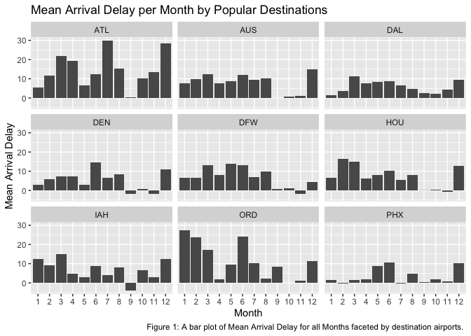
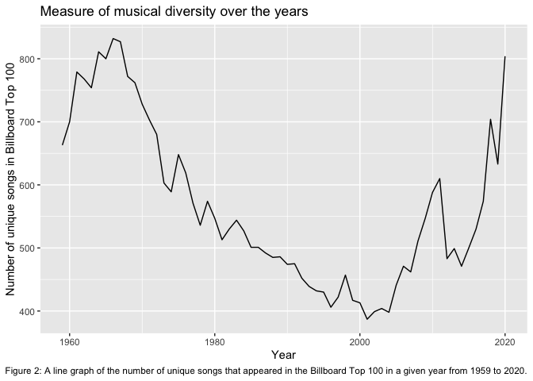
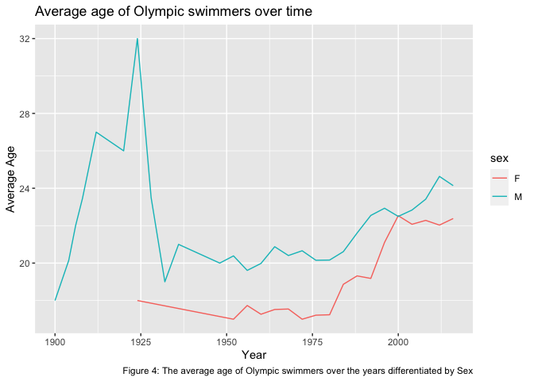
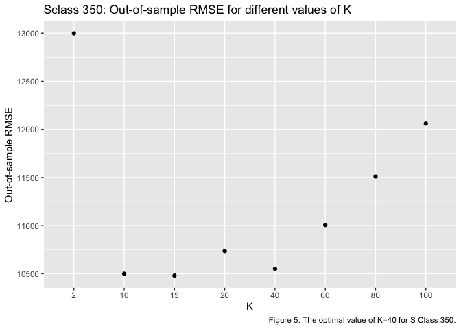
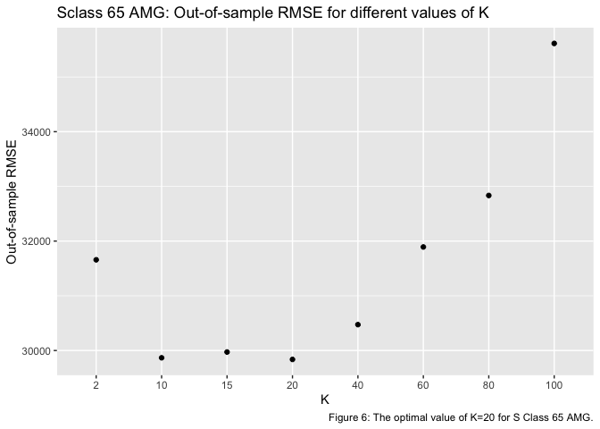
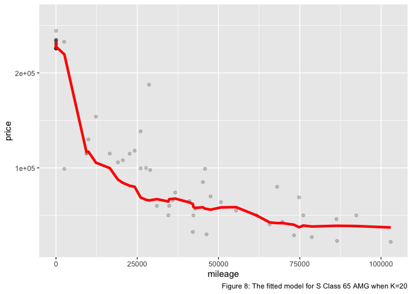

Problem 1 Data visualization: flights at ABIA
=============================================

Check the number of destinations
--------------------------------

    ## [1] 53

Identify the most popular destinations as destinations with more than 2000 flights
----------------------------------------------------------------------------------

    ## 
    ##   ABQ   ATL   AUS   BNA   BOS   BWI   CLE   CLT   CVG   DAL   DEN   DFW   DSM 
    ##   435  2252 49637   792   368   730   380   659   653  5573  2673  5506     1 
    ##   DTW   ELP   EWR   FLL   HOU   HRL   IAD   IAH   IND   JAX   JFK   LAS   LAX 
    ##     1  1349   949   481  2319   367   670  3691   218   226  1358  1231  1733 
    ##   LBB   LGB   MAF   MCI   MCO   MDW   MEM   MSP   MSY   OAK   OKC   ONT   ORD 
    ##   692   245   470   459   632   712   834    55   444   236    88   305  2514 
    ##   ORF   PHL   PHX   RDU   SAN   SEA   SFO   SJC   SLC   SNA   STL   TPA   TUL 
    ##     1   290  2783   231   719   149   610   968   548   245    95   367    88 
    ##   TUS 
    ##   228

Chose the following Destinations
--------------------------------

\#ATL=2252 AUS=49637 DAL=5573 DEN= 2673 \#DFW= 5506 HOU=2319 IAH=3691
ORD=2514 PHX=2783

Create new data frame by Destination and Month for the most popular destinations
--------------------------------------------------------------------------------

    ## # A tibble: 108 × 4
    ## # Groups:   Month [12]
    ##    Month Dest  count mean_ArrDelay
    ##    <int> <chr> <int>         <dbl>
    ##  1     1 ATL     210          5.34
    ##  2     1 AUS    4365          7.66
    ##  3     1 DAL     597          1.58
    ##  4     1 DEN     182          2.82
    ##  5     1 DFW     453          6.43
    ##  6     1 HOU     202          6.56
    ##  7     1 IAH     303         12.6 
    ##  8     1 ORD     210         27.3 
    ##  9     1 PHX     233          1.67
    ## 10     2 ATL     183         11.6 
    ## # … with 98 more rows

\#\# What is the best time of year to fly to minimize delays, and does
this change by destination?

The plots reflect that September is probably the best month to fly in
the year as it has the lowest average arrival delays compared to other
months. This is generally true for all of the destinations except
Chicago O’Hare Int’l Airport (ORD) and Dallas Love Field Airport (DAL).
However, even for these exceptions, the average delays are relatively
lower in September. Furthermore, Denver Int’l Airport (DEN) and George
Bush Intercontinental Airport (IAH) even gain time in September since
their average arrival delays are negative. On a more general level, the
best range of months to fly to minimze arrival delays is September to
November, as the the average arrival delays are lower for this range
compared to other months. This too is generally true across
destinations, with Hartsfield-Jackson Atlanta Int’l Airport(ATL)
deviating from the general pattern slighty. ATL does not necessarily
have a consecutive range of months with lower delays, instead, it has
specific months, which include January, May, and September.

Problem 2: Wrangling the Billboard Top 100
==========================================

Part A
------

### Create a new data frame for the top 10 most poplar songs

<table>
<caption>The top 10 most popular songs since 1958 arranged by the total number of weeks that a song spent on the Billboard Top 100</caption>
<thead>
<tr class="header">
<th style="text-align: left;">Performer</th>
<th style="text-align: left;">Song</th>
<th style="text-align: right;">Total # of weeks</th>
</tr>
</thead>
<tbody>
<tr class="odd">
<td style="text-align: left;">Imagine Dragons</td>
<td style="text-align: left;">Radioactive</td>
<td style="text-align: right;">87</td>
</tr>
<tr class="even">
<td style="text-align: left;">AWOLNATION</td>
<td style="text-align: left;">Sail</td>
<td style="text-align: right;">79</td>
</tr>
<tr class="odd">
<td style="text-align: left;">Jason Mraz</td>
<td style="text-align: left;">I’m Yours</td>
<td style="text-align: right;">76</td>
</tr>
<tr class="even">
<td style="text-align: left;">The Weeknd</td>
<td style="text-align: left;">Blinding Lights</td>
<td style="text-align: right;">76</td>
</tr>
<tr class="odd">
<td style="text-align: left;">LeAnn Rimes</td>
<td style="text-align: left;">How Do I Live</td>
<td style="text-align: right;">69</td>
</tr>
<tr class="even">
<td style="text-align: left;">LMFAO Featuring Lauren Bennett &amp; GoonRock</td>
<td style="text-align: left;">Party Rock Anthem</td>
<td style="text-align: right;">68</td>
</tr>
<tr class="odd">
<td style="text-align: left;">OneRepublic</td>
<td style="text-align: left;">Counting Stars</td>
<td style="text-align: right;">68</td>
</tr>
<tr class="even">
<td style="text-align: left;">Adele</td>
<td style="text-align: left;">Rolling In The Deep</td>
<td style="text-align: right;">65</td>
</tr>
<tr class="odd">
<td style="text-align: left;">Jewel</td>
<td style="text-align: left;">Foolish Games/You Were Meant For Me</td>
<td style="text-align: right;">65</td>
</tr>
<tr class="even">
<td style="text-align: left;">Carrie Underwood</td>
<td style="text-align: left;">Before He Cheats</td>
<td style="text-align: right;">64</td>
</tr>
</tbody>
</table>

PART B
------

The line graph shows that the musical diversity in the Billboard Top 100
rose somewhat steadily from 1959 to mid 1960’s, reaching above 800
unique songs at the end of the period. From the mid 1960’s to early
2000’s, the musical diversity decreased sharply and fairly consistently,
reaching a low of approximately 390 unique songs in 2001, which is the
lowest value it reached between 1959 and 2020. From the early 2000’s
till 2020, the musical diversity was quite volatile, it rose sharply and
steadily till 2012, reaching over 600 unique songs. This steady rise was
followed by a sharp decline which continued till 2014, dropping the
number of unique songs to approximately 475 songs in 2014. 2014 onwards,
the musical diversity rose dramatically and fairly consistently, rising
to 800 unique songs in 2020. In general, musical diversity seems to vary
with time with volatility; the absence of flat regions in the line graph
reflects the instability of musical diversity over the years.

Part C
------

The bar plot shows the 19 artists who had at least 30 ten-week hits
which are songs that appeared on the Billboard Top 100 for at least ten
weeks.

Problem 3: Wrangling the Olympics
=================================

PART A
------

### The 95th percentile of heights for female competitors across all Athletics events

    ## # A tibble: 27 × 2
    ##    event                                       percentile_95
    ##    <chr>                                               <dbl>
    ##  1 Athletics Women's 1,500 metres                       172 
    ##  2 Athletics Women's 10 kilometres Walk                 170 
    ##  3 Athletics Women's 10,000 metres                      168.
    ##  4 Athletics Women's 100 metres                         180.
    ##  5 Athletics Women's 100 metres Hurdles                 176 
    ##  6 Athletics Women's 20 kilometres Walk                 173 
    ##  7 Athletics Women's 200 metres                         180 
    ##  8 Athletics Women's 3,000 metres                       170 
    ##  9 Athletics Women's 3,000 metres Steeplechase          177.
    ## 10 Athletics Women's 4 x 100 metres Relay               176 
    ## # … with 17 more rows

PART B
------

### The single women’s event with the greatest variability in competitor’s heights across the entire history of the Olympics

    ## [1] "Rowing Women's Coxed Fours"

PART C
------

The average age of Olympic swimmers over time
---------------------------------------------

    ## # A tibble: 46 × 3
    ## # Groups:   year [28]
    ##     year sex   mean_age
    ##    <int> <chr>    <dbl>
    ##  1  1900 M         18  
    ##  2  1904 M         20.1
    ##  3  1906 M         22  
    ##  4  1908 M         23.5
    ##  5  1912 M         27  
    ##  6  1920 M         26  
    ##  7  1924 F         18  
    ##  8  1924 M         32  
    ##  9  1928 M         23.5
    ## 10  1932 M         19  
    ## # … with 36 more rows

From 1900 to early 1920’s, the average age of male Olympics swimmers
rose fairly steadily and sharply from 18 years old to 32 years old,
approximately. For the same period, there is missing data for female
Olympics swimmers so no comparison can be made of average age over time
by sex. From early to early 1930’s, the average age of males fell
sharply and consistently to 19 years old, approximately. The average age
for females also fell during this time period but much less
dramatically. From the early 1930’s to the early 1980’s, the average age
for both males and females remained relatively constant hovering around
20-years-old for males and 17-years-old for females, approximately.
After the early 1980’s, both genders saw a steady but gradual increase
in the average age, leading to an average age of 24-years-old for males
and 22-years-old for females. Generally, the average age experienced an
upward trend for both the genders since the early 1980’s. Although, the
average age for females has been lower than that of the males, they seem
to be converging in the later years.

Problem 4: K-nearest neighbors
==============================

    ##  [1] id           trim         subTrim      condition    isOneOwner  
    ##  [6] mileage      year         color        displacement fuel        
    ## [11] state        region       soundSystem  wheelType    wheelSize   
    ## [16] featureCount price       
    ## <0 rows> (or 0-length row.names)

\#Make a plot of RMSE versus K to find the optimal value of K for each
trim

\#Optimal value of K=40 for S Class 350

Optimal value of K=20 for S Class 65 AMG
----------------------------------------

### Plots of fitted model for optimal values of K for each trim

### Which trim yields a larger optimal value of K?

The optimal value of K for S Class 350 is 40, whereas, the optimal value
of K for S Class 65 AMG is 20.So, S Class 350 yields a larger optimal
value of K. This can be attributed to the size of the two data frames,
sclass\_350 has 416 observations, whereas sclass\_65 has 292
observations. Therfore, more data points can be averaged for S Class 350
as compared to S Class 65 AMG, hence K is larger for S Class 350.
